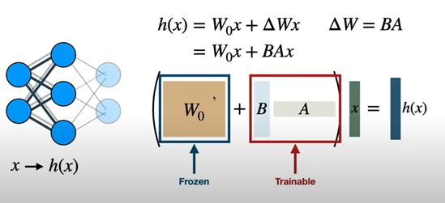
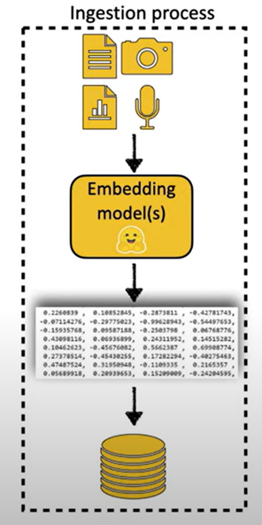
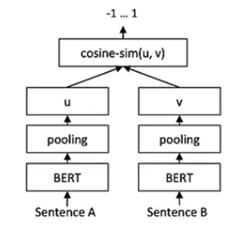
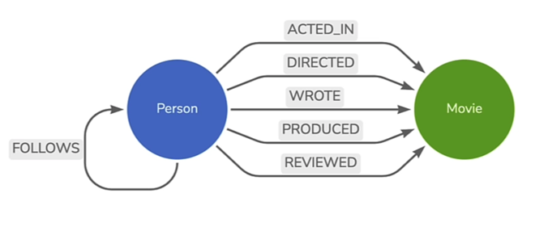
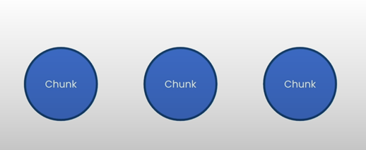
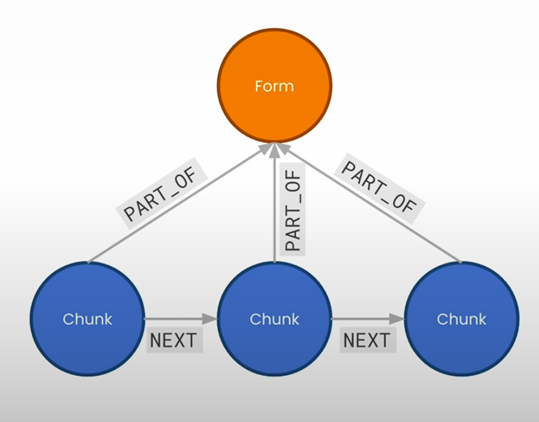
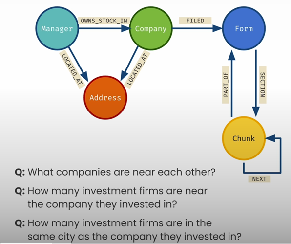

<div class="container"; style="text-align: center;">
    <h1>Large Language Models and Gen AI</h1>
</div>

## Machine Learning

### Self-study

#### LLM Inference Call

**Role**  
To send an input to LLMs we need to determine role and content. Possible defined roles are:
- HumanMessage: To interact with the model
- AIMessage: A message from the model
- SystemMessage: An instruction for the model helping it how to behave.
- FunctionMessage
- ToolMessage

**Temperature**  
When loading the model we can determine how much the outputs are close to deterministic while even with temperature=0 it will not be completely deterministic.

### Fine-tuning

To fine-tune a LLM we can take two approaches:
1. Supervised learning
2. Reinforcement learning

#### Supervised Fine-tuning

In this method, we can have multiple variations based on how we are going to update the model parameters. 

- **Update all parameters**: Usually, this is an expensive task to perform.
- **Transfer learning**: Keep part of the model intact and change some layers only.
- **Parameter Efficient Fine-tuning (PEFT)**: In this method, all parameters of the base model are fixed and only a few parameters are augmented to the model and they are trained.
- **Low Rank Adaptation (LoRA)**: It is similar to PEFT while the augmented parameters are represented by multiplication of two vectors to have a lower number of parameters. The number of augmented parameters is controlled by a parameter called intrinsic rank of the model.



### LangChain

#### LLM Model

**Chain**  
It is a sequence of calls between objects in the LangChain. One can call directly the function `LLMChain` or use the pipe symbol to concatenate a sequence of instances (functions) in a chain.
```python
from langchain_core.output_parsers import StrOutputParser

output_parser= StrOutputParser()

review_chain = review_template | llm | output_parser
```

**Chat Model**  
**Retrieval-Augment Generation (RAG)**  
It is used for cases when the LLM model is trained with a general-purpose dataset and we want to use it on a domain-specific use case. Without proper fine-tuning, the results are shallow. Additionally, fine-tuning is an expensive task to run frequently to keep the model up-to-date. Alternatively, we use the RAG method to retrieve from domain-related references.

1. The first step of the RAG method is the ingestion process. We store embeddings of document corpus in some storage to query later. The storage can be a vector database (VDBMS) where retrieving methods such as ANN are already implemented.
2. Given a query, we embed the model and apply a semantic search or any other retrieval mechanism on the stored data and retrieve some related documents.
3. The third step is to engineer prompts with system prompts and using LLM we generate responses.


**Embedding**  
To embed text data and vectorize them, there are many alternatives. One example is Sentence BERT (SBERT) models. It consists of two BERT models and the last layer compares the embeddings of sentences A and B. 


**Retrieval**  
In large datasets, after vectorizing the document chunks and code snippets, etc., we can store them. For retrieval, we use nearest neighbor methods such as ANN (approximate nearest neighbors) or HNSW (Hierarchical Navigable Small World). The retrieved item could be a document chunk and we may need to add preceding sections or if there was a hyperlink providing the material in the hyperlink. This requires some engineering after retrieval.

There are several realizations of these vector embeddings such as Chroma, FAISS, Lance, OpenSearch, ElasticSearch, MongoDB, etc.

**Implement a Chatbot using RAG on AWS**:
We can load the model using SageMaker. We store the endpoint after loading the model. So it is possible to deploy an endpoint model on the cloud and interact with it using APIs.
We specify processing GPU as well when deploying. We can use LangChain (`SagemakerEndpoint`) to set up the model with a specific input-output format and give the model endpoint to it.
Without RAG setup, one can create `LLMChain` and run it with a query and get the answer.

AWS has options like Textract and Splitter to read and chunk the reference documents in PDF format.
Next, we embed documents optionally using available ones on HuggingFace.
One option for storage is FAISS which is very simple. We can set the database as a retriever to retrieve relevant items.
LangChain has a `RetrievalQA` method where we can use it to get prompts and retrieve from the database and generate answers using an LLM.

### Knowledge Graph

One approach to store data for retrieval is the knowledge graph. This has applications in RAG as well. In short, every node is a data record and edges represent relations. Using conventional methods such as vector embedding, one can apply cosine similarity to find relevant documents. While using a knowledge graph gives more freedom in searching for relevant chunks of the document. Nodes can have labels to group them. Relationships have types.

For example, we can define two vertices: Person “Andreas” Person “Andrew” and an edge knows “since 2024”. We can represent that using (Person)-[knows]->(Person). This is an introduction to the Neo4j library which exists in LangChain.

In another example, we look into person-movie relations. While every person and a movie has a set of properties they can have relationships as below:


**Neo4j**  
Neo4j is a package that we can create knowledge graphs and query the database. It uses its own query language similar to SQL which is called Cypher. See MyCodes for examples.

#### Knowledge Graph for RAG

A knowledge graph can be used to store and index chunks of data to later retrieve similar items in a RAG use case. Below is an approach that one can take:
1. Split sections into chunks using a LangChain text splitter:
```python
from langchain.text_splitter import RecursiveCharacterTextSplitter
```
This helps create chunks of text with possible overlaps.

2. Create a graph where each chunk is a node adding chunk metadata as properties.

3. Create a vector index.

4. Calculate text embeddings for each chunk and populate the index.

5. Perform a similarity search.

To use the full power of knowledge graphs, we can add additional nodes describing relations. If we create nodes only using chunks it looks like the figure below:


Now by defining other types of nodes we can describe relations:

In the example above, each chunk is part of a form, so it makes sense to create relations as above.

#### How Relationship Works
One use case is to use NEXT relationships to identify a window of context meaning the chunks that are sequentially related. So we can say when a similar chunk is identified, pick up all related chunks in a window of size “1” (i.e., the next chunk) and pass that to LLM (using the retriever module) to create an answer. See example Cypher below:

```cypher
retrieval_query_window = """
MATCH window=
    (:Chunk)-[:NEXT*0..1]->(node)-[:NEXT*0..1]->(:Chunk)
WITH node score window as longestWindow 
  ORDER BY length(window) DESC LIMIT 1
WITH nodes(longestWindow) as chunkList node score
  UNWIND chunkList as chunkRows
WITH collect(chunkRows.text) as textList node score
RETURN apoc.text.join(textList " \n ") as text
    score
    node {.source} AS metadata
"""
```

The relationships become important when we want to make the LLM not generate hallucinations. For example, detailed information about numbers or relations can be embedded in node relations and when querying the knowledge graph we make sure that it picks up the relations and accordingly correct information. See example Cypher below where we create a text using all the relationships and info to be provided to the LLM:
```cypher
cypher = """
    MATCH (:Chunk {chunkId: $chunkIdParam})-[:PART_OF]->(f:Form)
        (com:Company)-[:FILED]->(f)
        (mgr:Manager)-[owns:OWNS_STOCK_IN]->(com)
    RETURN mgr.managerName + " owns " + owns.shares + 
        " shares of " + com.companyName + 
        " at a value of $" + 
        apoc.number.format(toInteger(owns.value)) AS text
    LIMIT 10
    """
kg.query(cypher params={
    'chunkIdParam': ref_chunk_id
})
```
By adding more properties, we enable creating more relevant queries:


#### LLM Generating Cyphers
GPT-3.5 and above are doing a fairly good job in creating Cyphers. We can provide the knowledge graph schema and with proper prompts, LLMs are able to create Cyphers and execute.

LangChain provides a function that we can directly feed the Cypher in a QA and generate results for a chatbot:
```python
cypherChain = GraphCypherQAChain.from_llm(
    ChatOpenAI(temperature=0)
    graph=kg
    verbose=True
    cypher_prompt=CYPHER_GENERATION_PROMPT
)
```
