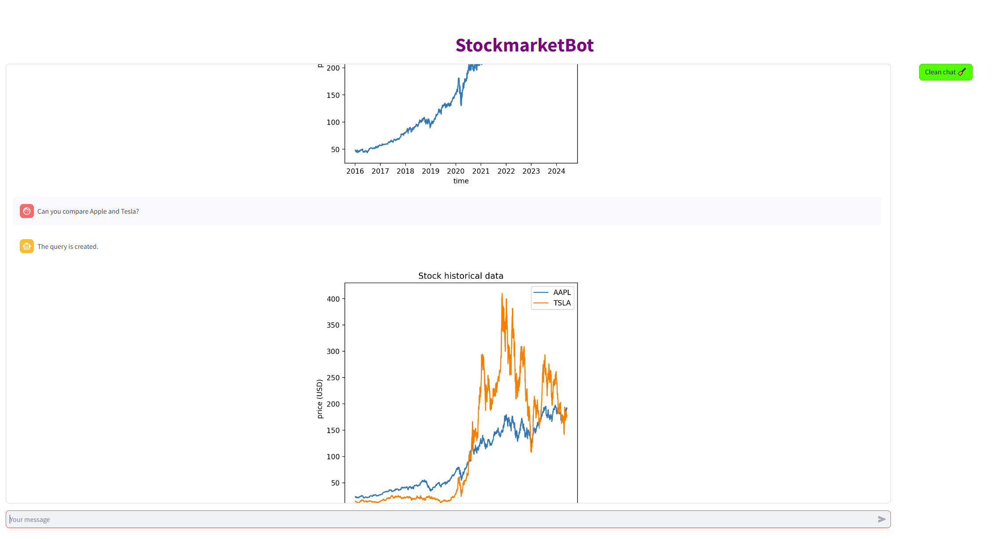

# My Notes
## Sequence Models and Natural Language Processing

This repository contains my notes and codes from my self study and courses in Coursera and Deeplearning.AI projects. 
- [Sequence Models](https://github.com/smolavipour/NLP_by_Sina/blob/main/Sequence%20Models/MyNotes_ML%209-1-Sequence%20Models.md)
- [LLM and generateive AI](LLM_GenAI/MyNotes_ML%209-4-LLM%20Gen%20AI.md)

# Small projects
## Stock market chatbot
This project is a chatbot that understands human input and answers and plots appropriate results. 
In this project we leverage **Lngchain** and **Huggingface** endpoints to run LLMs. 
The task is broken down into multiple chains and agents to pick up relevant data. Then **yfinance** API is used to read stock market historical data.

This is an ongoing project!

