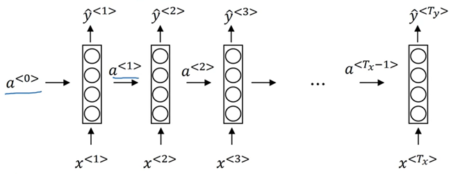
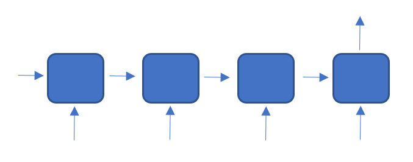
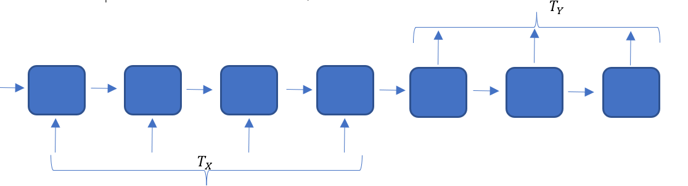
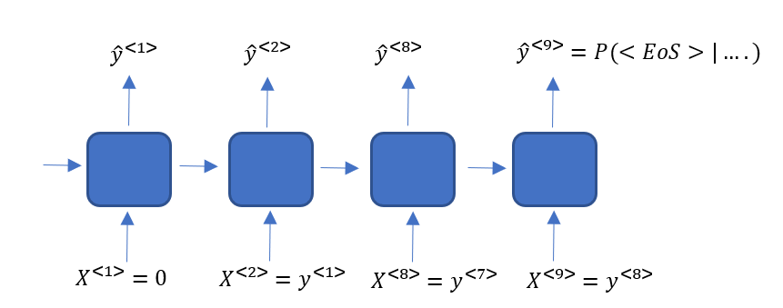
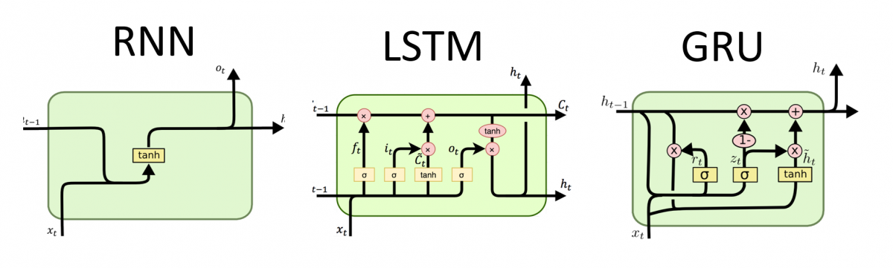
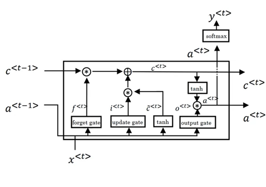
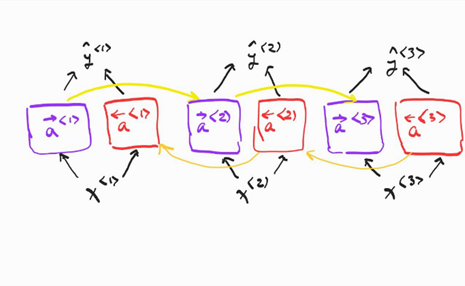
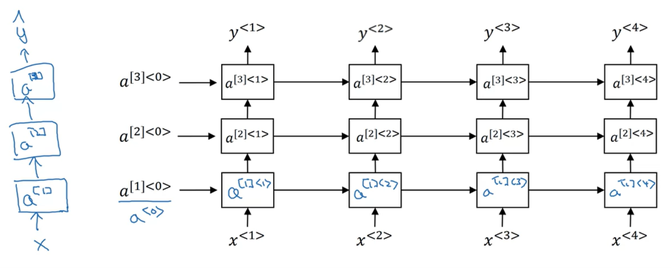
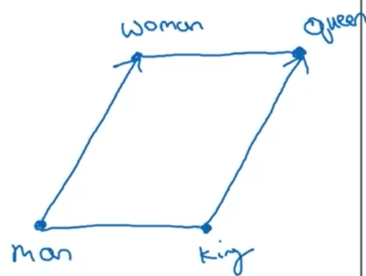

<p align="center">

</p>

<h1 align="center">
    Sequence Models
</h1>

<h2 align="center">
    Machine Learning Self-study
</h2>

# 1 Applications of sequence models:
- Speech recognition
- Music generation
- Sentiment classification (give stars to a content)
- DNA sequence analysis
- Machine translation
- Video activity recognition
- Name entity recognition
  
# 2 Notations
Consider a sentence as a sequence. We denote $X^{(i)[t]}$ to the $t$-th element of the $i$-uth sample, and we denote $T_X$ as the length of the input. 
Consider a dictionary (of size for instance 10k words). It is typical to have 30-40k size dictionary. So one way of representing words is using one-hot encoding which requires a vector of size 10k in our example.
# 3 Models developed for NLP
- **CBOW** (Continuous Bag of Word): The goal is to extract word embeddings. For every sequence, we take a fixed window as the context around each word. We build a vocabulary from all words and the representation for each word is one-hot encoding. Then we feed this representation in feed forward neural network to predict the central word’s embedding. This has a significant limitation which is the fixed length of the model. So recurrent models are suggested.
- **ELMo**: In this model, we use a bi-directional LSTM to predict the middle word and we can use all words before and after as the context.
	Transformer: It contains an encoder and decoder block based on attention mechanism
- **GPT**: It contains only a decoder and using that it predicts the next word. Originally it is uni-directional and it uses causal attention mask.
- **BERT**: It contains only encoder block and it uses bi-directional context. It is trained on two tasks, multi-mask language modeling and next sentence prediction which is binary decision for every query.
- **T5**: It contains an encoder decoder stack similar to the Transformer model and it uses bi-directional context. It is capable of multi-task such as both predicting the rate of a movie based on a review and answer a question and get an answer. It performs this by receiving a text as the indicator of the task.

# 4 Recurrent Neural Network
In this model, the parameters from input to the hidden units are called $w_{ax}$, while the parameters from hidden units of one step to next one is denoted by $w_{aa}$, and finally from hidden layer to output is shown with $w_{ya}$. 


## 4.1 Forward Propagation
Consider the RNN structure above. The forward propagation is described as below:
```math
\begin{align}
	&a^{[0]}=0\\
	&a^{[t]}=g(w_{aa}  a^{[t-1]} + w_{ax}  X^{[1]}+b_a)\\
	&y^{[t]}=g(w_{ya}  a^{[t]}+b_y)
\end{align}
```

Usually the activation function tanh() is used and sometimes ReLU.

To simplify the notation, we can concatenate $w_{aa}$ and $w_{ax}$ and refer to it as $w_a$. Then by stacking $a^{[t-1]}$ and $X^{[t]}$ we can rewrite:
```math
\begin{align}
	&a^{[t]}=g(w_a  [a^{[t-1]}│X^{[1]} ]+b_a )\\
	&\hat{y}^{[t]}=g(w_y  a^{[t]}+b_y)
\end{align}
```

## 4.2 Back Propagation
Let us define the loss function as:
```math
\begin{align}
L^{[t]} (\hat{y}^{[t]},y^{[t]})=-y^{[t]}  log⁡(\hat{y}^{[t]})- (1-y^{[t]})log⁡(1-\hat{y}^{[t]})\\
L(\hat{y}, y)=\sum_{t=1}^T L^{[t]} (\hat{y}^{[t]},y^{[t]} )
\end{align}
```

## 4.3 Various Types of RNN
It is possible that in some applications, the length of input and output are different. For instance, in sentiment classification, we may want to map a text to a score for instance (many-to-one relation). Then the architecture can be:



In another example such as machine translation, the architecture could be:



## 4.4 Language Model
To create a language model, we need a large corpus (text body) of text for training. To give it more structure, in a sentence we call each word (also called token) as  $y^{[1]},y^{[2]},\dots,y^{[10]}$ and we can allocate the end of a sentence `<EoS>` as a token as well. If a word is not in our dictionary, conventionally we can map that to unknown token `<UNK>`.
Consider that we are interested to train a model that gives a score to each sentence. For example, we want to give a score to the sentence:

<p align="center">
Cats average 15 hours of sleep a day. &lt EOS &gt
</p>

We have $P(y^{[1]},y^{[2]},\dots,y^{[9]} )=P(y^{[1]} )P(y^{[2]}│y^{[1]} )…P(y^{[9]}│y^{[1]}…y^{[8]})$. Then we can compute each of these scores using the following model:



It is also possible to design the model in character model. Then the dictionary would consist of characters and space and punctuations. 

To generate a sample from our model, simply we begin with an input for instance 0, and generate the output and use that output as the input of the next step. We continue this until we reach to `<EoS>`.

## 4.5 Vanishing/exploding Gradient Problem
In language applications, we may need long term dependencies. For instance, consider the following example where early words influence on the last words.

<p align="center">
The cat which always ate …., was full.
The cats which always ate …., were full.
<\p>
	
So, it is hard in back propagation to capture this long term dependencies and we face vanishing gradient. 
In some cases, when the derivatives become larger than 1, we may see exploding gradient and we need to address that by gradient clipping technique for instance. To address vanishing gradient, identity RNNs or skip connections are suggested. The best known approach to mitigate this is LSTM.

One conclusion is that we need to some how store the memory!

## 4.6 Gated Recurrent Unit
GRU is introduced to address the memory issue of RNN. Below is a schema of each RNN unit:
$a^{[t]}=tanh⁡(W_a [a^{[t-1]},x^{[t]}]+b_a)$

Let us define the memory as $c^{[t]}$. In RNN, we consider $c^{[t]}=a^{[t]}$.
For Gated Recurrent Unit (GRU), let us define a variable called candidate memory:
$\tilde{c}^{[t]}=tanh⁡(W_c [c^{[t-1]},x^{[t]}]+b_c)$
Then let us define the update gate function as:
$\Gamma_u=\sigma⁡(W_u [c^{[t-1]},x^{[t]}]+b_u)$
This gate somehow controls if we need to apply what we have stored in the memory or not. Like in the example above Gate tells us when it is important to care about was/were.
Then we can define: 
$c^=\Gamma_u *\tilde{c}^{[t]}+ 〖(1-\Gamma_u) *c^{[t-1]}$
The fill GRU has another gate (relevant gate) function $\Gamma_r$. So, the complete formulas become:

```math
\begin{align}
c^{[t]}&=tanh⁡(W_c[\Gamma_r* c^{[t-1]},x^{[t]}]+b_c )\\
\Gamma_u&=\sigma⁡(W_u [c^{[t-1]},x^{[t]} ]+b_u )\\
\Gamma_r&=\sigma⁡(W_r [c^{[t-1]},x^{[t]} ]+b_r )\\
c^{[t]}&=\Gamma_u  *\tilde{c}^{[t]}+ (1-\Gamma_u) *c^{[t-1]}
\end{align}
```

In academic literature, people may use the following literature:
$\tilde{c}=\tilde{h}, \Gamma_u=u, \Gamma_r=r, c=h$



## 4.7 Long Short-Term Memory (LSTM)
It contains of the following gates: Update, Forget, Output.



```math
\begin{align}
c^{[t]}&=tanh⁡(W_c[\Gamma_r*a^{[t-1]},x^{[t]}]+b_c )\\
\Gamma_u&=\sigma⁡(W_u [a^{[t-1]},x^{[t]} ]+b_u )\\
\Gamma_r&=\sigma⁡(W_r [a^{[t-1]},x^{[t]} ]+b_r )\\
\Gamma_o&=\sigma⁡(W_o [a^{[t-1]},x^{[t]} ]+b_o )\\
c^{[t]}&=\Gamma_u*\tilde{c}^{[t]}+ (1-\Gamma_u) *c^{[t-1]}\\
a^{[t]}&=\Gamma_o *tanh⁡(c^{[t]})
\end{align}
```
Forget gate decides what information is keep or discarded. Input gate decides what information to be added in the cell state. 

## 4.8 Bidirectional RNN
In the bidirectional RNN, each direction is completely independent of the other one. After the hidden state is computed, the final output would be computed using:
$\hat{y}^{[t]}=g(W_y [{\overrightarrow{a^{[t]}}},{\overleftarrow{a^{[t]}}}]+b_y)$



## 4.9 Deep RNN
Like deep NN, we can add more hidden layer to RNN/GRU/LSTM as well. Unlike deep RNN that may have many layers, deep RNNs have 2 3 layers and that is already a lot of parameters.



$a^{[2]&lt3&gt}=g(W_a^{2}  [a^{[2]&lt2&gt},a^{[1]&lt3&gt}]+b_a^{2} )$

# 5 Word Embedding
Suppose we have a dictionary $V$ with 10k samples. The one-hot representation of words is that it is a vector of dimension 10k with all zeros except one at the index of the corresponding word. We denote it by $O_{421}$ as an example for 421th word.

One way to do embedding is to use methods such as t-SNE. However, t-SNE is more to visualize the data in lower dimension. 

There are several ways to learn word embeddings:
- Have a large corpus of text 1-100 B words
- Download pre-trained embeddings
Then one can use transfer learning to a new task with smaller training set (100k words)

In this area we deal with context. Context could be 4 words, or for example 4 left words and 4 right words, and we want to predict the next word or the word in the middle respectively.

## 5.1 Analogy reasoning
It answers to questions such: the relation between `Man->Woman` is similar to the relation between `King->`? And the model should give the answer “Queen”. The accuracy of the current models is around 30-75%.
The conventional way is to compare the embedding vector using proper distance metrics. In t-SNE, due to non-linearities one should not expect to identify analogies, especially complicated parallel relationships as below:

One typical distance metric is cosine similarity which is basically:
```math
\begin{equation}
similarity=\frac{u^T v}{\lvert\lvert u\rvert\rvert_2  \lvert\lvert v\rvert\rvert_2}$
\end{equation}
```



This is much more used comparing to Euclidian distance.

## 5.2 Skip-gram (Word2Vec)
Let $c$ be the context (one word in this case) and t to be the target word in our dictionary of 10k words. The idea is that the target word is not far than a few words distance to the context word. It is called skip-gram since we skip some words from the context to look for the target. The goal is to upon a given context word, generate a  $\hat{y}$ that is likely to be the target. By using the softmax we have:
```math
\begin{equation}
p(t\lvert c)=\frac{e^{\Theta_t^T e_c}}{\sum_{j=1}^{10k} e^{\Theta_j^T e_c } }
\end{equation}
```

Where $e_c=E o_c$, $E$ is the embedding matrix mapping each word in the vocab to a vector, and $o_c$ is the one-hot vector corresponding to word $c$. 

**Problems**
Skipgram is computationally heavy since every time we have to some over the dictionary (10k). There are techniques to overcome this issue. Instead we can train layers of binary classifier as hierarchy that tells if the prediction is in the first half or the second half of the vocab. So instead of linear complexity $o(d)$ we would have logarithmic complexity $o(log⁡d)$.

Another thing to note is that words like **it**, **of**, **the**,… are very common and by uniformly sampling the context word in training, we may get biased training set. So we should take care of this as well.

## 5.3 Negative Sampling
Consider creating a dataset as following. Given a pair of words for example (“Orange”) and (“Juice”), we add k random words (negative examples) from dictionary (that probably it is not associated with these words). Then we assign a target value 1 to “Juice” and 0 to all other k samples. So we can train a model to tell if two words are close or not. $k$ is 2-5 for large datasets and 5-20 for smaller datasets.

Now to use this as a predictive model for predicting a target word given a context, we can train 10k binary classifiers for each target word. However, since for each context word, we only have $k+1$ pairs (i.e., k+1 classifiers), we are not updating all classifiers at once. This is much cheaper than training one softmax model to classify 10k groups.

**Problems**
Similar to skip-gram, there is a problem of getting biased when sampling negative examples. So, a heuristic way to sample words is to consider the distribution
```math
\begin{equation}
p(w_i)=\frac{f(w_i )^{3/4}}{\sum_{j=1}^{10k} f(w_i)^{3/4}}
\end{equation}
```
where $f(w_i)$ is the frequency of the word in English corpse. Then we sample according to this.

## 5.4 GLoVe Word Vectors
GLoVe stands for Global Vectors for Word Representation. Let us define $X_ct$ be #times $t$ appears in the context of $c$. Typically we assume $X_ct=X_tc$.
Let is define the loss function:
```math
\begin{equation}
Minimize \sum_{i=1}^{10k}\sum_{j=1}^{10k} f(X_{ij}) (\Theta_i^T e_j+b_i+b_j-\log⁡ X_{ij})^2 〗  
\end{equation}
```
Where $0\log⁡0=0$. 
This method is fairly easy and much faster than previous methods.

## 5.5 Embedding layer in libraries
The embedding layer in libraries is not a fixed lookup table, rather is trained during the training phase. Let us assume the desired output dimension is 10. Then the model initializes a table of dimension 10 for each word. Then for 1000 words, the matrix is 1000×10. So to access the embedding for each word, we can multiply a one-hot vector to this matrix and extract the corresponding vector. So the differentiation engine can use this multiplication to take the gradient and compute the matrix. It is possible to load a pre-trained model such as word2vec or GLoVe if the vocabulary and output dimension matches. In practice though, for fast implementation, the computer is not multiplying matrices and only takes the corresponding row from the matrix.

# 6 Sentiment Classification Problem
One famous use case of this category of problem is to understand the rating stars based on the review.


So $E$ is obtained using a large database 100B words beforehand.
We can then take the average over the feature vectors e and pass it through a Softmax to predict the rating. So it does not matter to deal with a short or long review. There is a problem with the current model which is that a word NOT can change the whole context, so if we have so many “Good” words in the review the average feature vector of “good” dominates and we give it a five star while we missed the important “NOT” word. So it is suggested to use RNN sentiment analysis instead.


# 7 De-biasing 
There are biases in our society and accordingly in our corpse of text. This holds true in other applications as well when we need to keep a balance and de-bias our method. Let us look at this from word embedding perspective. So the first step is to identify the direction of bias.

## 7.1 Identify the bias direction
To learn about the direction of bias given the word embeddings, we can collect examples such as 
```math
\begin{align}
e_{he}&-e_{she}
e_{male}&-e_{female}
e_{father}&-e_{mother}
\end{align}
```

And take an average over these vectors to identify the direction of bias.
In more complicated approaches, we can use PCA, t-SNE or SVD to extract eigen vectors and identify which one is related to the corresponding bias.

## 7.2 Neutralize
Some words are biased intrinsically: male, female, father, mother and words like doctor, nurse, leader should be neutralized. For the words that are not intrinsically biased, we project them on the space orthogonal to the identified bias vector.

## 7.3 Equalize pairs
For the intrinsically biased words, such as male and female, we set the distance between male and the orthogonal space equal to the distance between female and the orthogonal space.


# 8 LSTM for classification
In case we want to use LSTM for classification, one first problem is that the length of words could be different. Then we can use padding to make all the lengths the same.


# 9 Sequence to Sequence Model (seq2seq)
## 9.1 Text translation
The input goes into an RNN/LSTM and the output is a vector. Then the vector is treated as the input to another RNN/LSTM to generate a sequence. The model was first proposed by Google in 2014. By using LSTM or GRU we overcome the vanishing/exploding gradient problems. In the encoding section, the input tokens are passed through an embedding layer first. The hidden state between encoder and decode captures the meaning of the sentence.


One main problem of this model is that although input and output may have different length, the size of hidden state is fixed and that forms a bottleneck for conveying the message from encoder to decoder. It is not possible to use all hidden states in the encoder due to memory issue as the input sequence becomes larger. The solution is **Attention models**.

One main difference of this model with random generation model is that we do not want the output translation be different every time a same input comes in. So in the decoding part, what we need is to take most probable translation. 
```math
\begin{align}
\arg⁡max_{y^{&lt 1 &gt},…,y^{&lt T_y &gt}}⁡ p(y^{&lt 1 &gt},…,y^{&lt T_y &gt} |x)
\end{align}
```

We do not want to do a greedy approach to pick each word separately solely depending on the previously selected words. The reason is that in many occasions just by following the most probable word at each step, we may drift apart from the best possible translation of the whole sentence.

**Beam Search Algorithm**

Given the vector from encoding part, the algorithm 
- computes $B$ most likely words as the first word for translation.
- Next for each $B$ (beam width) word as $y^{&lt 1 &gt}$, we give it as input to the next block and compute the likelihoods of the outcome. Then we can compute the joint likelihood as $p(y^{&lt 1 &gt} |X)p(y^{&lt 2 &gt} |X,y^{&lt 1 &gt})$ for all words in the vocabulary and pick the top B combinations $y^{&lt 1 &gt} y^{&lt 2 &gt}$.
- The algorithm continues to extract next words until it reaches `<EoS>`.

There is a concern that the product of all these probabilities becomes very small. So it is recommended to use logarithm of probabilities and sum over them.
It is recommended also to normalize the length with respect to $T_y$. In the algorithm there is a parameter α and the argmax is modified as:

```math
\begin{align}
\arg⁡max⁡ \frac{1}{T_y^α}  \sum_{t=1}^{T_y} \log⁡ P(y^{&lt t &gt}│x,y^{&lt 1 &gt},…,y^{&lt t-1 &gt}) 
\end{align}
```

The algorithm repeats the optimization above for some choices of $T_y$ and among all $B$ sequences for all $T_y$ choices, we pick the highest score and report as the output translation.

- High $B$ results better results but slower ($B=10$ is a good choice for a product, $B=100$ or higher is good for research)
- Unlike BFS and DFS, beam search is much faster but there is no guarantee to find exact match


**Beam Search error**

Suppose we have made a translation using Beam search and an RNN. Consider a sentence being translated by human to be $y^{\*}$, and the generated translation by the model to be $\hat{y}$ which is not a very accurate translation. 
To understand the source of error we can compute $P(\hat{y}|x)$ and $P(y^{\*} |x)$ and compare them (To do this, one computes the likelihood of each word when fixing the input). Two cases may occur:


- $P(\hat{y}│x)>P(y^{\*} |x)$: then RNN is not accurate.

We do this comparison for a set of examples to draw a conclusion.

**BLEU Score (Bilingual evaluation understudy)**

In a translation task, there could be several valid translations. To score the translation we may use BLEU metric. If we look into each word (unigram) in the machine translation, we have:
- **Precision** for a word: # of times that appear in references, over the # of words in the machine translation
- **Modified Precision** for a word: Maximum # of times that appear in references (count_clip), over the # of words in the machine translation (count)
Similarly, we can define the metrics above for a combination of two words (bigram). Now let us define Bleu score on m-grams:
```math
\begin{align}
P_m=\log⁡ \frac{\sum_{m_{gram} \in \hat{y}} count_{clip}(m_{gram})}{\sum_{m_{gram}\in \hat{y}} count(m_{gram})}
\end{align}
```
Then we can define combined bleu score and compute precision scores as:
```math
\begin{align}
P=BP \exp⁡ \frac{1}{M} \sum_{m=1:M} P_m
\end{align}
```

Where BP is a coefficient as brevity penalty to penalize short translations:
```math
\begin{align}
BP=min ⁡(1,e^{1-\frac{ref}{cand}})
\end{align}
```

And `ref` and `cand` are number of words in the reference and candidate translation. BLEU score is a precision score.
